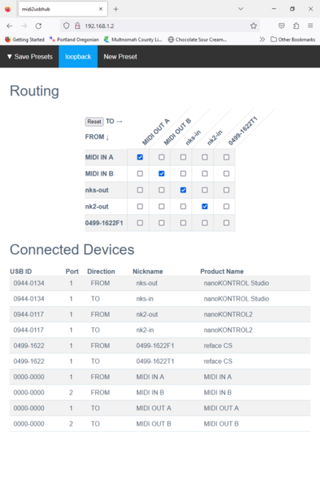

# midi2usbhub-web
A Pico W interconnects USB MIDI devices and 2 old school MIDI ports with web browser routing control.

This is an example of the web interface.

.

This code was originally supposed to be part of the the [midi2usbhub](https://github.com/rppicomidi/midi2usbhub) project, but the hardware and features were different enough
that it deserved a project of its own.

This project uses a Pico W board, a micro USB to USB A adapter, and a powered USB hub
to run software that routes MIDI data among all the devices connected to the hub.
There are 2 UART DIN MIDI INs and 2 UART DIN MIDI OUTs, so you can connect
to old school MIDI too. You can route the UART MIDI the same way your route USB MIDI.
You configure the routing with and embedded web server. You use a 128x64 OLED and USB
keyboard connected to the USB hub to manage the Wi-Fi connection. You can also use
command line interpreter (CLI) commands through a serial port terminal to manage Wi-Fi
connection and MIDI routing.

The software uses some of the Pico W board's program flash for a file system
to store configurations in presets. If you save your settings to a preset, then
the midi2usbhub-web software will automatically reload the last saved preset on startup
and when you plug a Connected MIDI Device to the hub. You can back up any or all of
your presets to a USB Flash drive connected to the USB hub. Presets are stored in
JSON format. You can use a USB keyboard and the OLED to recall other presets, or
you can use the serial port terminal CLI.

# Request for Pull Requests
My programming career has focused on low-level embedded programming, so my
web programming skills are weak. If you can write better
HTML/CSS/Javascript code or just think a different web interface would work
better, you can find the files the embedded web server serves in the fsdata/fs
directory.  Just note that one goal of the web interface is to work
even if the Wi-Fi provides no connection to the Internet, so no relying
on styles, fonts or other content pulled from from the Web. The other goal is
to have everything you need on one page so you don't have to go digging.

# Project Status
## 13-Mar-2023
Moved code over from the midi2usbhub project and updated documentation.


# Hardware
## Bill of Materials
- Pico W Board
- USB A female breakout board
- USB C female breakout board
- SSD1306-based 128x64 OLED display module
- 4x 5 pin DIN female MIDI connectors
- 2x Sharp PC900V or H11L1-type optoisolators
- 2x 470ohm 1/4W resistors
- 2x 220ohn 1/4W resistors
- 3x 0.1 uF ceramic capacitors
- 2x 33ohm 1/2W resistors
- 2x 10ohm 1/4W resistors
- 0.1" perforated board
- M2 hardware for holding the board to the case and the display to the case
- 30awg hookup wire
- small plastic case

## Sample Assembly

This shows the midi2usbhub-web device fully assembled. All the holes and cutouts
are made with a non-electric drill, a knife and some files. The lower left display
attachment screw interferes with the debug connector, so I had to leave the screw
out. Also, the debug connector had to be low profile or else the case won't close.
Try to take issues into account if you build your own. With better tools or just
more patience than I had, you could probably make this look pretty nice.


This is how I placed the components on the perforated board. You should be able
to see from the photo that only the power pins for the USB C connector are wired.


## Wiring
I am sorry, but I didn't actually draw a wiring diagram to build this. If you
really need one, please file an issue and I will try to get to it.

I used standard [3.3V MIDI IN](https://diyelectromusic.wordpress.com/2021/02/15/midi-in-for-3-3v-microcontrollers/)
and [MIDI OUT](https://www.midi.org/specifications/midi-transports-specifications/5-pin-din-electrical-specs)
circuits. The code shows to what Pico W pins I wired the outputs of the MIDI IN circuits
and the inputs of MIDI OUT circuits. Because the code uses PIO for the MIDI UART TX, I was
able to make the UART output pins that drive MIDI OUT circuits behave like open drain pins.
It also allowed me to have 2 old school MIDI ports without using the native RP2040 UART hardware.

The Pico W gets 5V power from the USB C connector. The 5V is wired directly to VBus.

The OLED is wired to the 3.3VDC output of the Pico W board. The code shows which pins are SCL and SDA.

This is how I wired the USB host port to the Pico W (I wound up moving the
red VBus wire to the Pico W connector to make the assmebly a litte nicer).


I connected the host port to a 4-port powered USB 2.0 hub and I connected the USB C breakout board
to an old USB phone C charger I had.

Please test everything carefully before you connect this to your expensive MIDI gear or even your
moderately expensive USB hub.

# Setting Up Your Build and Debug Environment
I am running Ubuntu Linux 20.04LTS on an old PC. I have Visual Studio Code (VS Code)
installed and went
through the tutorial in Chapter 7 or [Getting started with Raspberry Pi Pico](https://datasheets.raspberrypi.com/pico/getting-started-with-pico.pdf) to make sure it was working
first. I use a picoprobe for debugging, so I have openocd running in a terminal window.
I use minicom for the serial port terminal (make sure your linux account is in the dialup
group).

## Using a tinyusb library that supports USB MIDI Host
The Pico SDK uses the main repository for tinyusb as a git submodule. Until the USB Host driver for MIDI is
incorporated in the main repository for tinyusb, you will need to use the latest development version in pull
request 1627 forked version. This is how I do it.

1. If you have not already done so, follow the instructions for installing the Raspberry Pi Pico SDK in Chapter 2 of the 
[Getting started with Raspberry Pi Pico](https://datasheets.raspberrypi.com/pico/getting-started-with-pico.pdf)
document. In particular, make sure `PICO_SDK_PATH` is set to the directory where you installed the pico-sdk.
2. Set the working directory to the tinyusb library
```
cd ${PICO_SDK_PATH}/lib/tinyusb
```
3. Get the pull request midihost branch
```
git fetch origin pull/1627/head:pr-midihost
```
4. Checkout the branch
```
git checkout pr-midihost
```
## Get the project code
Clone the midiusb2hub project to a directory at the same level as the pico-sdk directory.

```
cd [one directory above the pico-sdk directory]
git clone --recurse-submodules https://github.com/rppicomidi/midi2usbhub.git
```

## Command Line Build (skip if you want to use Visual Studio Code)

Enter this series of commands (assumes you installed the pico-sdk
and the midid2usbhub-web project in the ${PICO_MIDI_PROJECTS} directory)

```
export PICO_BOARD=pico_w
export PICO_SDK_PATH=${PICO_MIDI_PROJECTS}/pico-sdk/
cd ${PICO_MIDI_PROJECTS}/midi2usbhub
mkdir build
cd build
cmake ..
make
```
The build should complete with no errors. The build output is in the build directory you created in the steps above.

# Terms this document uses
- **Connected MIDI Device**: a MIDI device connected to a USB hub port or to a serial
port MIDI DIN connector.
- **USB ID**: A pair of numbers the Connected MIDI Device reports to the
hub when it connects. They are supposed to be unique to a particular
product.
- **Routing Matrix**: The software that sends MIDI data to and from Connected MIDI Devices
- **Terminal**: a MIDI data input to or output from the Routing Matrix.
- **FROM terminal**: an input to the Routing Matrix. It will be a MIDI OUT signal from
a Connected MIDI Device.
- **TO terminal**: an output from the Routing Matrix. It will be a MIDI IN signal to
a Connected MIDI Device.
- **Port**: usually a group of 1 MIDI IN data stream and one MIDI OUT data stream associated with a Connected MIDI Device. A Port of a Connected MIDI Device may omit MIDI IN or MIDI OUT, but not both. Ports are numbered 1-16
- **Direction** of a terminal: either FROM the Connected MIDI Device's MIDI OUT
or TO the Connected MIDI Device's MIDI IN.
- **Nickname**: a more human name than specifying a device port's FROM and TO
data streams using a USB ID, a Port number and a Direction. Nicknames have
a maximum of 12 characters. The default nickname for a port in a given
direction is the USB ID followed by either a "F" for a FROM data stream or
"T" for a TO data stream, followed by the port number (1-16). For example,
the default reface CS product's MIDI OUT data source is 0499-1622F1. You
might want to rename that to something friendlier like "lead-out" instead.
- **Product Name**: a name that identifies the the attached MIDI
device. The Connected MIDI Device sends it to the hub on connection; it is a more friendly
name than USB ID, and is the easiest way to assocate the Connected MIDI Device
with all the other info.

# OLED + HID Keyboard Interface
You use the menus on the OLED display for configuring the WiFi connection. You can also use the CLI to do this, but if you have the CLI you don't really need Wi-Fi
and can use the simpler `midi2usbhub` project instead. The reasons there are no
buttons for menu navigation on this project are I wanted to keep the project,
low cost and small, and really most Wi-Fi setup requires entering
a password; using up/down/left/right arrows for entering text is awful.

The OLED displays status and simple test menus. You navigate the menus
with the up arrow key and the down arrow key on a HID keyboard that you
attach to the USB hub. The OLED shows the selected
menu item in reverse video. If you press the Enter key on your keyboard, you will
trigger the action associated with the select menu item. The action either toggles
a value, sends you to sub-menu, or triggers a command like "Connect..." If a
submenu calls for entering text, then the Enter key finalizes text input. To
exit a submenu, press the Escape key to exit up one level or the Home key to go
back to the home screen.

## Connecting to Wi-Fi using the OLED + HID Interface

This section shows the initial setup process using the keyboard and the OLED.
Navigate the other items in `Wi-Fi setup...` for more features and options.

1. Select `Wi-Fi setup...`


2. Select the Wi-Fi country region. The default is Worldwide. You should use
that option if you don't know the correct region and your country is not shown.


3. Choose your country (in my case, USA)


4. Start an SSID scan


5. Select your Wi-Fi router. As you choose different RSSI levels, the two lines
at the top of the menu will change to show the router name. In my case it is
called `rppicomidi wi-fi router`


6. After you select the router, enter the password if required. The password will
display in plain text, so I don't show it in the next screenshot.


7. The system will return to the home screen and show connection status


8. If connection is successful, the IP address of the Pico W board is displayed


9. Point your browser at `http://[the IP address shown].index.html` and you
should see a display similar to the web interface at the beginning of this document.

Once Wi-Fi is set up, you probably don't need to keep the HID keyboard connected.
The midi2usbhub-web will remember the last Wi-Fi setup even if you cycle power
and will attempt to reconnect to it on power up.

## Using the HID keyboard and OLED to choose the current preset

If you don't need to keep the Wi-Fi interface live or otherwise can't connect
to Wi-Fi, you can still use save presets if you have a keyboard handy. From
the home screen, navigate to the current preset name and press the Enter key.
Choose the preset you want and press the Enter key again. The Pico W will load
the selected preset and display its name on the home screen.

# Web Interface
Refer to the figure at the top of the page. The Web Interface has been tested
with Chrome and Safari on a Mac, Firefox on a Windows 10 PC and on Linux,
Edge on Windows 10, Safari on an iPad and Chrome on an Android phone. YMMV
for other browser/host configurations.

The menu bar is used for preset management. You can Save, Load, Rename and Delete
presets. You choose the mode by clicking/touching the upper left label and then
choosing one of 4 buttons to select the mode.

The Routing section shows the sources of MIDI data to the left and sinks of
MIDI data on top. If a checkbox at the intersection between a source row and
and sink column is checked, then MIDI data from the source will be sent to
the sink. If multiple sources are checked for a single sink, then the MIDI
streams from all checked sources will be merged to the sink.

The Connected Devices section show a list of all of the sources and sinks.
You can edit the Nickname field by clicking on it, editing it, and clicking
rename. It is strongly recommended that you do this for USB MIDI devices
unless you care to learn the USB IDs. If you save your changes to a preset,
then you will only have to do this once.

# Command Line Commands
## help
Show a list of all available commands and brief help text.

## list
List all Connected MIDI Devices currently connected to the USB hub. For example:

```
USB ID      Port  Direction Nickname    Product Name
0000-0000    1      FROM    Drumpads    MIDI IN A
0000-0000    1       TO     TR-707      MIDI OUT A
0499-1622    1      FROM    lead-out    reface CS
0499-1622    1       TO     lead        reface CS
1C75-02CA    1      FROM    keys        Arturia Keylab Essential 88
1C75-02CA    1       TO     keys-in     Arturia Keylab Essential 88
1C75-02CA    2      FROM    faders      Arturia Keylab Essential 88
1C75-02CA    2       TO     faders-in   Arturia Keylab Essential 88
```

## rename \<Old Nickname\> \<New Nickname\>
Rename the nickname for a product's port. All nicknames must be unique. If you need to
hook up more than one device with the same USB ID, then you must do so one at a
time and change the nickname for each port before attaching the next one to the hub.

## connect \<From Nickname\> \<To Nickname\>
Send data from the MIDI Out port of the MIDI device with nickname \<From Nickname\> to the
MIDI IN port of the device with nickname \<To Nickname\>. If more than one device connects
to the TO terminal of a particular device, then the streams are merged.

## disconnect \<From Nickname\> \<To Nickname\>
Break a connection previously made using the `connect` command.

## reset
Disconnect all routings.

## show
Show a connection matrix of all MIDI devices connected to the hub. A blank box means "not
connected" and an `x` in the box means "connected." For example, the following shows
MIDI OUT of the "keys" device connected to the MIDI IN of the "lead" device.

```
       TO-> |   |   |   |
            |   |   |   |
            |   |   |   |
            |   |   | f |
            |   |   | a |
            | l | k | d |
            | e | e | e |
FROM |      | a | y | r |
     v      | d | s | s |
            | - | - | - |
            | i | i | i |
            | n | n | n |
------------+---+---+---+
lead        |   |   |   |
------------+---+---+---+
keys        | x |   |   |
------------+---+---+---+
faders      |   |   |   |
------------+---+---+---+
```

## save \<preset name\>
Save the current setup to the given \<preset name\>. If there is already a preset with that
name, then it will be overwritten.

## load \<preset name\>
Load the current setup from the given \<preset name\>. If the preset was not previously
saved using the save command, then print an error message to the console.

## backup [\<preset name\>]
Copy the specified preset to USB flash drive to a file on the drive named `/rppicomidi-midi2usbhub/<preset name>`. If no preset name is given, then all presets are copied to the
flash drive.

## restore \<preset name\>
Copy the specified preset from the USB flash drive directory `/rppicomidi-midi2usbhub/<preset name>` to the file system on Pico board's program flash.

## format
Reformat the LittleFs file system in the Pico's program memory. It delete all presets.

## fsstat
Print information about the LittleFs file system

## ls [path]
List all files in the LittleFs file system. If you specify a `path`, then list the contents
of the `path` directory. For now, the only directory path is `/`.

## rm \<filename\>
Deletes the file with name \<filename\> in the LitteFs file system

## f-cd [path]
Change current directory of the current USB flash drive to `path`. If `path` is not specified,
equivalent to `f-cd /` (i.e., set to the drive root directory).

## f-chdrive \<drive number 0-3\>
Change current drive number for the USB flash drive. Will only need to do this if you have
more than one flash drive plugged in. When you plug in a drive, the code automatically
sets the drive number to the latest drive.

## f-ls [path]
List contents of the current directory on the current USB flash drive if `path` is not
specified. Otherwise, list the contents of the specified path.

## f-pwd
Print the current directory path of the current USB flash drive.

## set-date \<year(2022-9999)\> \<month(1-12)\> \<day(1-31)\>
Change real-time clock date. The date and time is used for external flash drive file timestamps.

## set-time \<hour(0-23)\> \<minute(0-59)\> \<second(0-59)\>
Change the real-time clock time of day.
The date and time is used for external flash drive file timestamps.

## get-datetime
Print the current date and time as read from the on-chip real-time clock. The time
has a resolution of 2 seconds as because that is what is required for flash drive
file timestamps. The initial date and time will be the last time you built the
msc-rp2040rtc library.
